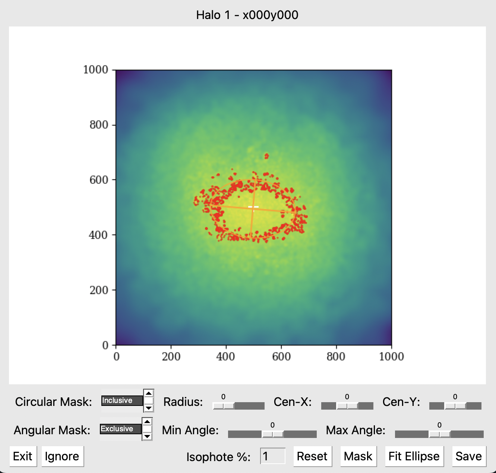

# Morphology Measurement Methods

## Setup
**Required packages**: corner, emcee, multiprocessing, pandas, pymp, pynbody, PySimpleGUI, scipy, skimage

###Config.py
Set up all the simulation information and initialize the directory for v-band images.

## Isophote Collection
Scripts in the "IsophoteImaging" directory are responsible for generating the mock-observation images, identifiying isophotes, and fitting ellipses to them. They should be run in the following sequence: 

ImageCollection &rarr; IsophoteFitting &rarr; Isophote Masking

### ImageCollection.py
Can be automatically run on all sims via CollectAll.py. Requires initialization of Image directory through Config.py. 

**Description**: Generates v-band luminosity density images for visual inspection and isophote identification. Also generates luminosity profile data. Images/Profiles are generated at all orientations. 

**Required Arguments** 
\-s/--simulation: Name of simulation to analyze (as defined in Config.py) 
\-f/--feedback: Feedback model of simulation 
\-n/--numproc: The number of processers to use for multiprocessing 

**Optional Flags** 
\-i/--image: Generate v-band images in addition to profile data (will take significantly longer to run) 
\-o/--overwrite: Overwrite existing data 
\-v/--verbose: Output halo ID's as they're being analyzed 

**Outputs** 
Generates "Profiles" files for each sim in the "Data" directory. If the "--image" flag is given, it will also generate "Images" files and Images for each halo in the "Figures/Images" directory.

### IsophoteFitting.py
Can be automatically run on all sims via FitAll.py. Requires the Images files from ImageCollection.py.

**Description**: Identifies isophotes in the v-band luminosity density images, and fits an ellipse to measure the b/a axis ratios.

**Required Arguments** 
\-s/--simulation: Name of simulation to analyze (as defined in Config.py) 
\-f/--feedback: Feedback model of simulation 
\-n/--numproc: The number of processers to use for multiprocessing 

**Optional Flags** 
\-v/--verbose: Output halo ID's as they're being analyzed 

**Outputs** 
Generates "ShapeData" files for each sim, giving the b/a axis ratios for each halo/orientation. If the isophote fit RMS values are sufficiently high, the halos are flagged for manual masking, which is tracked through the "Masking" files.

### IsophoteMasking.py
Requires the isophote and Masking files from IsophoteFitting.py.

**Description**: Checks the Masking file for halos/orientations that are flagged for manual isophote fitting

**Required Arguments** 
\-s/--simulation: Name of simulation to analyze (as defined in Config.py) 
\-f/--feedback: Feedback model of simulation 

**Outputs** 
Updates the ShapeDate file with manually calculated isophote axis ratios, and removes the associate flag from the Masking file.

**How to Use**
 
**Circular Mask**: Determine whether a circular mask should select isophote points inside (Inclusive) or outside (Exclusive) of the circle. Use the sliders to determine the radius and center (X,Y) point of the circle. 
**Angular Mask**: Determine whether isophote points inside or outside of the angular region are selected. Use the sliders to set the angle-limits of the region. 
**Mask**: Apply cuts to the isophote points based on the defined masks. 
**Isophote %**: By default, isophotes are defined as points within 1% of the effective surface brightness, but this number can be altered in this field. 
**Fit Ellipse**:Will fit an ellipse to the current isophote points, and display it in orange. 
**Save**: Save the current ellipse fit and update the ShapeData file with the new b/a axis ratio. 
**Ignore**:Ignore the given image, and update the ShapeData file with a NaN value. Some galaxies/orientations don't image cleanly, so use this option to remove them from analysis. 
**Exit**: Close the GUI, and abort the code. Running the code again will continue the process where you left off.

## Intrinsic Shape Calculation
Scripts in the "IntrinsicShapes" directory are responsible for calculating intrinsic 3D shapes of our galaxies and dark matter halos. These shapes can be projected into 2D at various orientations for direct comparison to isophote measurements. They should be run in the following sequence: 

3DShapeCollection &rarr; 3DShapeSmoothing &rarr; 2DShapeProjection

### 3DShapeCollection.\<Stars/Dark>.py
Can be automatically run on all sims via CollectAll.py.  Stars must be run before Dark.

**Description**: Calculate the 3D axis-rations B/A and C/A as a function of radius based on shape tensor calculations. 

**Required Arguments** 
\-s/--simulation: Name of simulation to analyze (as defined in Config.py) 
\-f/--feedback: Feedback model of simulation 
\-n/--numproc: The number of processers to use for multiprocessing 

**Optional Flags** 
\-v/--verbose: Output halo ID's as they're being analyzed 

**Outputs** 
Generates 3DShapes/DMShapes files for the given simulation giving 3D ellipsoid fits as a function of radius.

### 3DShapeSmoothing.py
Requires 3DShapeCollection to be run on both Stars and Dark Matter

**Description**: Smoothes the B/A and C/A radial profiles for each galaxy.

**Outputs** 
Updates the 3DShapes and DMShapes dictionary files with new keys for smoothed profiles. Also generates images showing the raw and smoothed radial profiles in each simulation's subdirectory in "Figures/3DShapes".

### 2DShapeProjection.py
Can be automatically run on all sims via FitAll.py. 

**Description**: Projects the smoothed intrinsic shapes to the 2D plane at all orientations for isophote comparison. 

**Required Arguments** 
\-s/--simulation: Name of simulation to analyze (as defined in Config.py) 
\-f/--feedback: Feedback model of simulation 
\-n/--numproc: The number of processers to use for multiprocessing 

**Optional Flags** 
\-p/--plot: Plot the projections over v-band images and isophotes 

**Outputs** 
Creates a ProjectedData file for each simulation. If the --plot flag is passed, then it will plot the 2D projections over the isophotes in the v-band luminosity images found in "Figures/Images".

### StellarDMTracing.py
Generates plots in "Figures/3DShapes" comparing the 3D shapes of galaxies and their dark matter halos.

### StellarDMTracing.py
Generates plots in "Figures/EllipticityComparison" comparing isophote measurements to 2D shape tensor projections.

###GalaCollector.py
Can be automatically run on all sims via CollectAll.py 

Preliminary code modelling stellar and dark matter density profiles with spherical harmonic expansion. Generates SCFData files, as well as density profile images in "Figures/Gala". Can be automatically run on all sims via CollectAll.py

##MCMC Deprojection
Scripts in the "MCMC" directory are responsible for calculating MCMC deprojection of isophote data into 3D axis ratio measurements. They should be run in the following sequence: 

GridInterpolation &rarr; MCMC &rarr; PynbodyMCMCComparison

###GridInterpolation.py

**Description**: The MCMC deprojection process requires a smooth sampling of isophotes over 3D space, while our imaging is discretized in 30 degree increments. This script uses the scipy's RegularGridInterpolator to interpolate isolate values in between the actual imaged isophotes.

**Outputs** 
Generates "InterpolataionFunction" files for each simulation. Also generates images in "Figures/Interpolaation" to show how the data is being filled.

###MCMC.py
Can be automatically run on all sims via FitAll.py 

**Description**: Runs the MCMC Deprojection process outlined in Kado-Fong et al. 2021. 

**Required Arguments** 
\-s/--simulation: Name of simulation to analyze (as defined in Config.py) 
\-f/--feedback: Feedback model of simulation 
\-n/--numproc: The number of processers to use for multiprocessing 

**Optional Flags** 
\-o/--overwrite: Overwrite existing data 

**Outputs** 
Generates MCMC files for each sim giving the inferred 3D axis ratios. Also generates images for each halo in "Figures/MCMC" detailing the MCMC process and how the results compare to the shape tensor values.

###PynbodyMCMCComparison.py
Generates plots in "Figures/MCMC" comparing MCMC deprojection values to shape tensor calculations.

##Ellipticity-Surface Brightness Correlation

Scripts in the "XuComparison" directory perform the Ellipticity-Surface Brightness Correlation analysis from Xu et al. 2020.

###DynamicalMass.py
Can be automatically run on all sims via CollectAll.py 

**Description**: Collects dynamical masses for all galaxies in a simulation

**Required Arguments** 
\-s/--simulation: Name of simulation to analyze (as defined in Config.py) 
\-f/--feedback: Feedback model of simulation 
\-n/--numproc: The number of processers to use for multiprocessing 

**Outputs** 
Generates DynamicalMasses files for each simulation

###XuCorrelation.py
Generates various plots testing the Ellipticity-Surface Brightness Correlation and saves them to "Figures/CorrelationTesting"